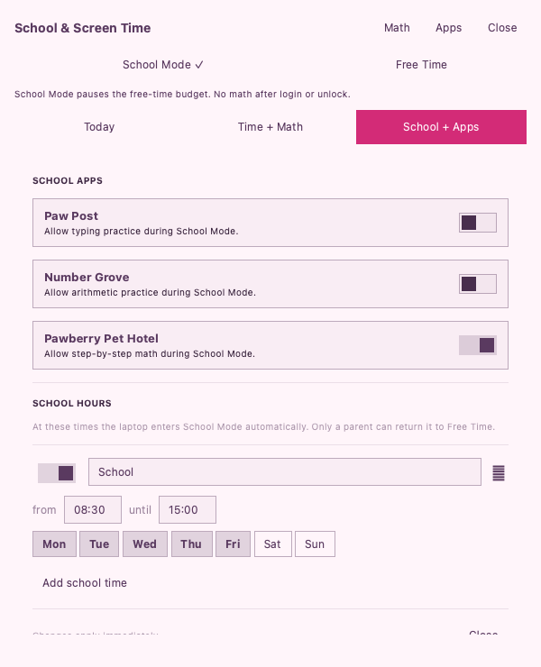

# School & Screen Time

One control panel for school schedules, apps, free-time budgets, bedtime and math rewards.

A community plugin for **Omarchy Quattro with the Quickshell plugin system**. It works on a regular Omarchy installation; an Omarchy Kids ISO or fork is not required. The plugin ID is `io.github.peterholko.screen-time`.



## Install

Run these commands in the intended user's Omarchy desktop session:

```bash
omarchy plugin add https://github.com/peterholko/omarchy-screen-time --enable
omarchy bar put io.github.peterholko.screen-time --section right
```

### Set up the background service

Adding the shell plugin alone does not install or authorize a privileged service. Review `setup` and `service/`, then run this in a terminal. Replace `CHILD_USERNAME` with the local account to enroll (for example, `linnea`):

```bash
omarchy pkg add python
sudo "$HOME/.config/omarchy/plugins/io.github.peterholko.screen-time/setup" --user CHILD_USERNAME
```

Setup asks for a new **controls parent password** of at least eight characters. School & Screen Time uses this password and the `omarchy-kids-controls.service` service. Setup copies only this repository's local, reviewed payload; it does not download code. The one plugin contains both controls. An upgrade preserves existing settings and enrollments; a fresh setup enrolls both controls. Use matching plugin releases; mismatched service versions require an explicit `--upgrade`, and unknown files or locally modified installed service files stop setup.

Only the named account is enrolled. Root owns the password hash, schedules, budgets and reward checks. The UI sends passwords over stdin, and the local service authenticates callers by their Unix socket peer credentials. It rate limits failed parent-password attempts. The controls password is separate from the login, administrator and disk passwords.

These are desktop controls for a cooperative family setup. An account that retains administrator access can disable the service, and user-controlled shell plugins are not an application sandbox. This installer does not convert or demote OS accounts. It refuses to enroll an account already configured for the original Omarchy Kids backend, to prevent two services enforcing different policies.

### Allow the temporary school desktop changes

In the enrolled user's desktop, run the following **without sudo**. This explicitly permits School Mode to temporarily hide the stock launcher, route `Super+Space` and `Super+Alt+Space` to the school app list, disable the standard Omarchy app-launch shortcuts, quiet notifications and park existing windows. Free Time restores the previous state; windows are not closed.

```bash
python3 -I "$HOME/.config/omarchy/plugins/io.github.peterholko.screen-time/school/school-desktop.py" enable
```

Click the School & Screen Time widget to open the one control panel. Today shows the budget, activity and time grants; Time + Math sets budgets, bedtime and recall level; School + Apps sets school hours and app permissions. Free Time and changes to the schedule or allowed apps require the controls parent password; the password field displays checking feedback. School Mode never automatically opens Math Time after login or unlock, and stops an earning session already in progress. Deliberately opened practice remains optional. Bedtime still applies.

The settings include optional access to Number Grove, Paw Post Typing and Pawberry Pet Hotel when their desktop launchers are installed. Service 2.2.0 supports [Pawberry 1.4.0](https://github.com/peterholko/omarchy-pawberry)'s in-game **Parents** screen for independent addition/subtraction daily limits and optional screen-time rewards. Parents choose minutes per completed problem and a Pawberry daily maximum; rewards start off and share the overall earning cap. Both time rewards and daily limits are saved with the controls parent password. Other desktop IDs can be configured with the client’s `config patch` command.

There is one browser profile. This plugin does not filter websites; use a separate DNS/browser policy if needed. The filtered launcher and standard shortcut changes do not prevent custom shortcuts, terminal commands or manually started applications.

The desktop helper journals recovery before applying changes and changes only its own `disabledPlugins` entry in `~/.config/omarchy/shell.json`. Other bar and shell settings are preserved. It keeps a first-use backup under `~/.local/state/omarchy-community-school-mode/`. Custom `XDG_CONFIG_HOME` and `XDG_STATE_HOME` are respected by the helper. Run `school-desktop.py disable` before disabling or removing the plugin; this also revokes desktop consent.

Math Time is bundled inside this same plugin. Open optional practice with:

```bash
omarchy-shell shell summon io.github.peterholko.screen-time math
```

At zero free time, the service locks the session; after a normal OS unlock, the combined plugin opens its Math Time activity to earn minutes. It first checks the current mode, so School Mode cannot trigger this handoff. The controls parent password can grant a short bypass. The stock OS lock screen continues to use the account's normal unlock credentials. The separately published Math Time plugin is only needed when installing arithmetic practice by itself.

### Manage enrollment and password

```bash
sudo omarchy-kids-controls password
sudo omarchy-kids-controls disable controls --user CHILD_USERNAME
sudo omarchy-kids-controls enable controls --user CHILD_USERNAME
```

### Service paths and dependencies

The shared service uses Python 3's standard library, systemd/logind and Omarchy's shell/lock/notification commands. School desktop effects also use Bash 5, Hyprland's Lua IPC, jq and flock, supplied by Omarchy. No pip packages, network services or API keys are needed.

- Code: `/usr/lib/omarchy-kids-controls/`
- Commands: `/usr/bin/omarchy-kids-controls` and `omarchy-kids-controls-{time,school,grove,pawberry}-client`
- Unit: `/etc/systemd/system/omarchy-kids-controls.service`
- Private configuration and password: `/etc/omarchy-kids-controls/`
- Private service state and per-user read-only status: `/var/lib/omarchy-kids-controls/`
- Local socket: `/run/omarchy-kids-controls/sock`

## Update

```bash
omarchy plugin update io.github.peterholko.screen-time
```

Review any service changes, then update the root-owned copy explicitly:

```bash
sudo "$HOME/.config/omarchy/plugins/io.github.peterholko.screen-time/setup" --user CHILD_USERNAME --upgrade
```

Updating the user-owned shell checkout never silently replaces the installed privileged service. Upgrade preserves each existing account’s enabled/disabled time and school enrollment. To explicitly enable both for an account, run `sudo omarchy-kids-controls enable controls --user CHILD_USERNAME`.

### Move from the old separate School Mode plugin

Before enabling this combined plugin, restore the desktop with the old plugin and disable its UI (without sudo, in the child’s desktop):

```bash
python3 -I "$HOME/.config/omarchy/plugins/io.github.peterholko.school-mode/school-desktop.py" disable
omarchy plugin disable io.github.peterholko.school-mode
```

Then install/update this plugin and run its `setup --upgrade` command above. Enable the combined plugin’s school desktop helper as shown above. The service reuses the existing school and time configuration; do not remove the old service module or its state to perform this migration.

## Remove

First restore the desktop **in each enrolled user's active session**, without sudo:

```bash
python3 -I "$HOME/.config/omarchy/plugins/io.github.peterholko.screen-time/school/school-desktop.py" disable
```

Disable this module's enrollments and remove its service installation before removing the shell plugin:

```bash
sudo omarchy-kids-controls remove controls
omarchy plugin remove io.github.peterholko.screen-time
```

Removing `controls` disables both parts and removes the service, unit and owned command wrappers after restoring school desktops. Configuration, password and history are retained for a deliberate reinstall; inspect `/etc/omarchy-kids-controls/` and `/var/lib/omarchy-kids-controls/` before deleting that data yourself. Modified or unexpected installed files stop automatic removal for review.

## License and source

MIT. See [LICENSE](LICENSE) and [ATTRIBUTION.md](ATTRIBUTION.md) for retained copyright notices and asset provenance. [SOURCE.json](SOURCE.json) records the source revision and reproducible exporter in [Omarchy Kids](https://github.com/peterholko/omarchy-kids).

## Validation

```bash
omarchy plugin validate .
```

These packages are checked with the upstream manifest validator and local source tests. Full desktop enforcement, systemd installation and removal require validation on an actual Omarchy laptop. There are no GitHub Actions workflows in this repository.
